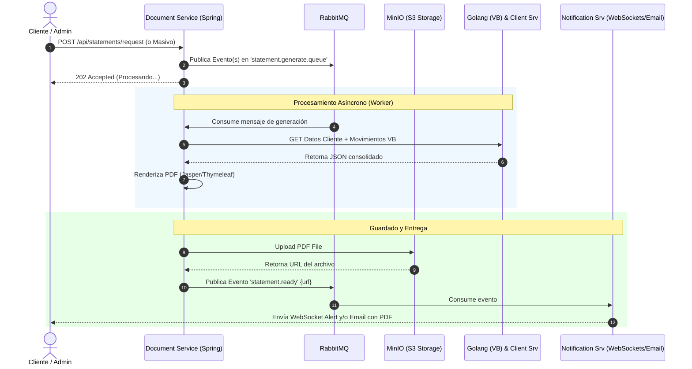

```mermaid
sequenceDiagram
    autonumber
    
    actor Cliente as Cliente / Admin
    participant DocSrv as Document Service (Spring)
    participant MQ as RabbitMQ
    participant S3 as MinIO (S3 Storage)
    participant Internals as Golang (VB) & Client Srv
    participant Notif as Notification Srv (WebSockets/Email)

    %% Petición Inicial
    Cliente->>DocSrv: POST /api/statements/request (o Masivo)
    DocSrv->>MQ: Publica Evento(s) en 'statement.generate.queue'
    DocSrv-->>Cliente: 202 Accepted (Procesando...)

    %% Procesamiento en Segundo Plano
    rect rgb(240, 248, 255)
        Note over DocSrv, Internals: Procesamiento Asíncrono (Worker)
        MQ->>DocSrv: Consume mensaje de generación
        DocSrv->>Internals: GET Datos Cliente + Movimientos VB
        Internals-->>DocSrv: Retorna JSON consolidado
        DocSrv->>DocSrv: Renderiza PDF (Jasper/Thymeleaf)
    end

    %% Almacenamiento y Notificación
    rect rgb(230, 255, 230)
        Note over DocSrv, Notif: Guardado y Entrega
        DocSrv->>S3: Upload PDF File
        S3-->>DocSrv: Retorna URL del archivo
        DocSrv->>MQ: Publica Evento 'statement.ready' {url}
        MQ->>Notif: Consume evento
        Notif-->>Cliente: Envía WebSocket Alert y/o Email con PDF
    end
```
