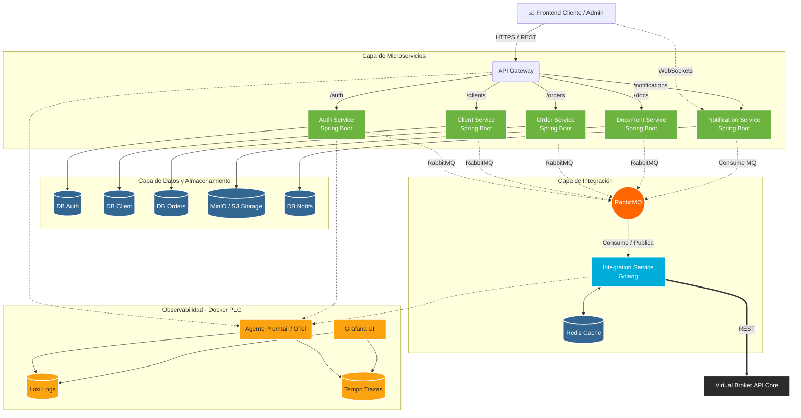
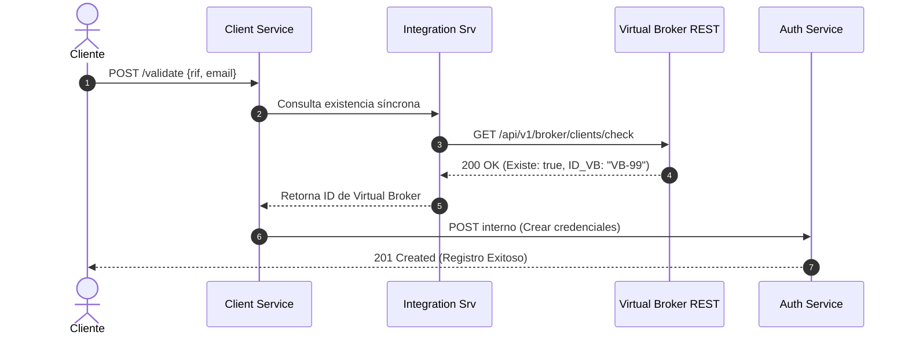
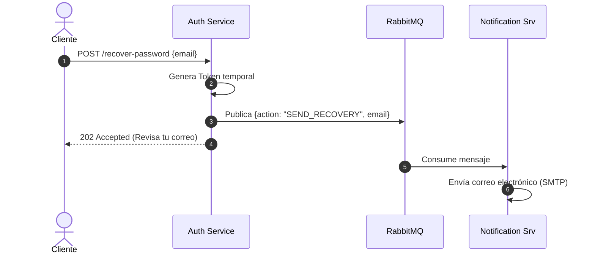
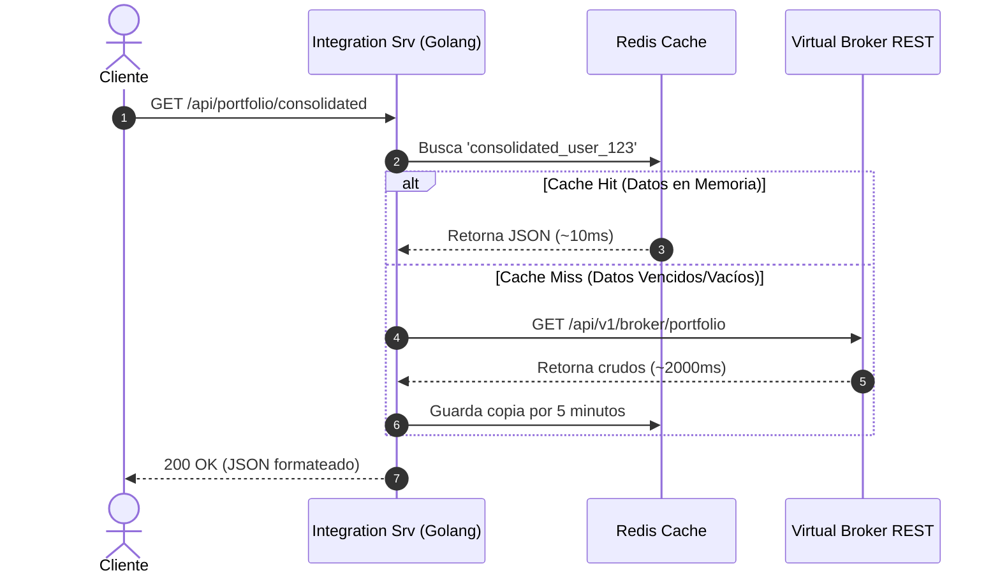
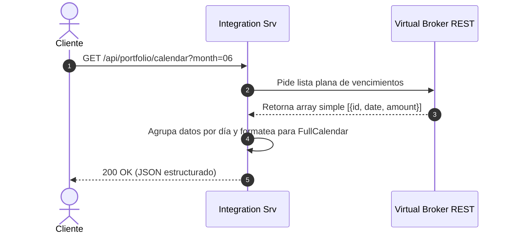
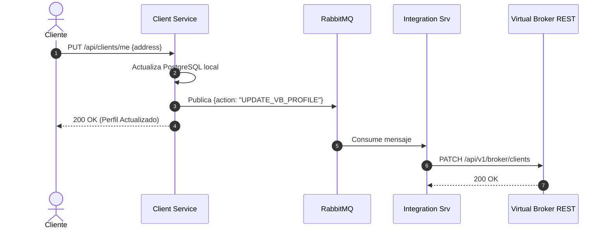
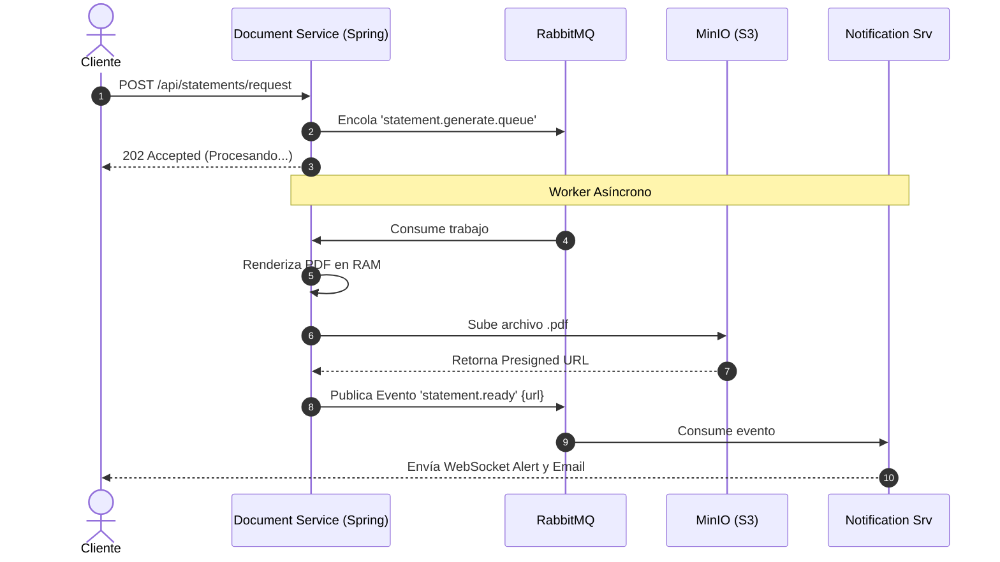

# 🏛️ Documento de Arquitectura de Software (SAD) - UbiBroker

**Proyecto:** UbiBroker
**Fecha:** 27 de Mayo de 2026
**Versión:** 1.0.0

---

## 1. Resumen Ejecutivo
UbiBroker es una plataforma web transaccional diseñada para interactuar con el core de una casa de bolsa (Virtual Broker). La plataforma permite a clientes registrados consultar posiciones consolidadas, detalles de productos, calendarios de vencimientos y crear órdenes/reinversiones. Además, incluye un panel de Backoffice para que ejecutivos aprueben operaciones mediante un flujo "Maker-Checker". 

La arquitectura está basada en microservicios contenerizados (Docker), garantizando alta disponibilidad, separación de responsabilidades y tiempos de respuesta en milisegundos mediante el uso de cachés (Redis) y procesamiento asíncrono (RabbitMQ).

---

## 2. Stack Tecnológico
* **Backend Transaccional:** Spring Boot (Java)
* **Backend de Alto Rendimiento:** Golang
* **Bases de Datos Relacionales:** PostgreSQL (Patrón Database-per-Service)
* **Caché en Memoria:** Redis
* **Mensajería Asíncrona:** RabbitMQ
* **Almacenamiento de Archivos:** MinIO / Amazon S3
* **Observabilidad:** Stack PLG (Promtail, Loki, Tempo, Grafana) + OpenTelemetry

---

## 3. Catálogo de Microservicios

| Microservicio | Tecnología | Base de Datos | Responsabilidad Principal |
| :--- | :--- | :--- | :--- |
| **API Gateway** | Spring Cloud / Nginx | N/A | Único punto de entrada. Enrutamiento y validación inicial de JWT. |
| **Auth Service** | Spring Boot | PostgreSQL | Gestión de identidades, login, recuperación de contraseñas, JWT y OTP. |
| **Client Service** | Spring Boot | PostgreSQL | Mantiene el perfil local del usuario y valida RIF contra Virtual Broker. |
| **Integration Service** | Golang | Redis | Capa anticorrupción (BFF). Lectura masiva ultrarrápida del core de VB. |
| **Order Service** | Spring Boot | PostgreSQL | Motor transaccional. Gestiona el ciclo de vida de órdenes y aprobaciones. |
| **Document Service** | Spring Boot | MinIO (S3) | Worker asíncrono para generación y almacenamiento de PDFs (Estados de cuenta). |
| **Notification Service**| Spring Boot | PostgreSQL | Centro omnicanal. Envía WebSockets, Emails y guarda buzón de alertas. |

---

## 4. Diagrama de Arquitectura Global

## 5. Casos de Uso y Flujos de Datos (Sequence Diagrams)

Caso 1: Registro por ID/RIF y Correo
Descripción: El cliente verifica si existe en la casa de bolsa para poder crear sus credenciales web.

    
Caso 2: Recuperación de Usuario/Contraseña
Descripción: El cliente solicita restablecer su acceso mediante un código (OTP) o enlace enviado a su correo registrado.

Caso 3: Consulta de Operaciones y Tableros (Posición Consolidada)
Descripción: El cliente entra al sistema y visualiza sus saldos, productos activos y transacciones pasadas de manera inmediata.

Caso 4: Creación de Órdenes y Reinversiones (Flujo Maker-Checker)
Descripción: El cliente crea una orden (o reinvierte un vencimiento). La orden queda en pausa hasta que un ejecutivo la aprueba en el Backoffice.

Caso 5: Visualización de Vencimientos en Calendario Interactivo
Descripción: El cliente revisa los vencimientos de sus productos en una vista de calendario sin que su dispositivo deba realizar cálculos complejos.

Caso 6: Actualización de Datos Personales
Descripción: El cliente modifica su dirección o teléfono desde UbiBroker y el sistema sincroniza la información con el core de la casa de bolsa.

Caso 7: Generación de Estados de Cuenta (PDF)
Descripción: El cliente solicita su estado de cuenta mensual. El sistema lo genera de fondo para no bloquear la interfaz y le notifica cuando está listo.

## 6. Diccionario de Endpoints REST (Contratos Base)

Esta tabla resume los endpoints expuestos a través del API Gateway, los cuales actúan como el contrato de comunicación entre el Frontend y los microservicios.

| Microservicio | Endpoint | Método | Descripción |
| :--- | :--- | :--- | :--- |
| **Auth** | `/api/auth/login` | `POST` | Autenticación y generación de JWT. |
| **Auth** | `/api/auth/recover-password` | `POST` | Dispara el flujo de recuperación de credenciales. |
| **Client** | `/api/clients/validate` | `POST` | Valida RIF/ID contra Virtual Broker. |
| **Client** | `/api/clients/register` | `POST` | Crea perfil local del cliente. |
| **Client** | `/api/clients/me` | `GET` | Consulta de perfil del cliente. |
| **Client** | `/api/clients/me` | `PUT` | Actualización de datos personales. |
| **Portfolio**| `/api/portfolio/consolidated` | `GET` | Posición global (saldos y totales vía Redis). |
| **Portfolio**| `/api/portfolio/products` | `GET` | Detalle de inversiones activas. |
| **Portfolio**| `/api/portfolio/calendar` | `GET` | Eventos de vencimiento formateados. |
| **Orders** | `/api/orders` | `POST` | Crear nueva orden o reinversión. |
| **Orders** | `/api/orders` | `GET` | Listar histórico de órdenes. |
| **Orders** | `/api/admin/orders` | `GET` | Listar pool de órdenes pendientes (Ejecutivos). |
| **Orders** | `/api/admin/orders/{id}/approve` | `POST` | Aprobación ejecutiva de transacción. |
| **Documents**| `/api/statements/request` | `POST` | Solicitar generación de estado de cuenta. |
| **Notif** | `/api/notifications` | `GET` | Obtener historial de alertas no leídas. |
| **Notif** | `/api/notifications/{id}/read` | `PATCH`| Marcar notificación como leída. |
| **Notif** | `wss://{host}/ws/notifications` | `WS` | Canal STOMP para alertas en tiempo real. |
WS wss://{host}/ws/notifications -> Canal STOMP persistente para alertas en tiempo real.
