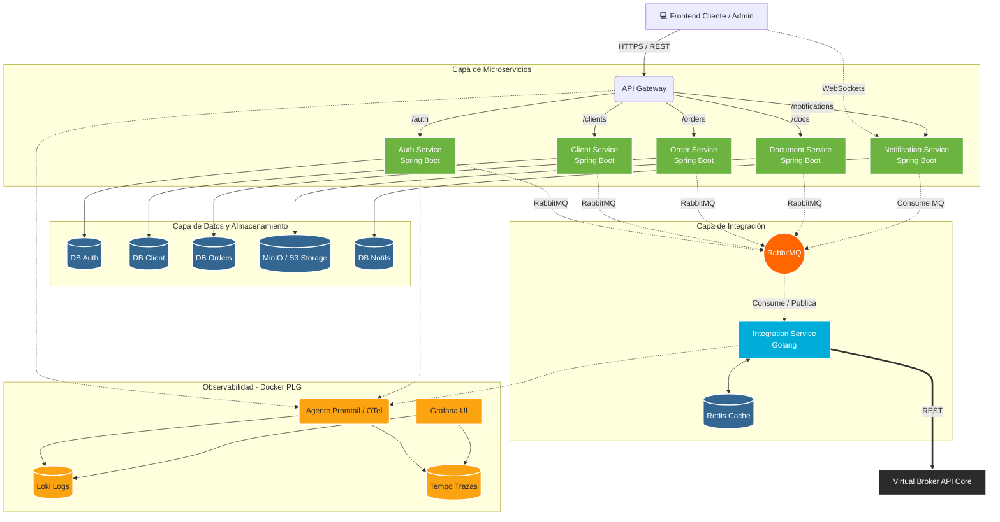
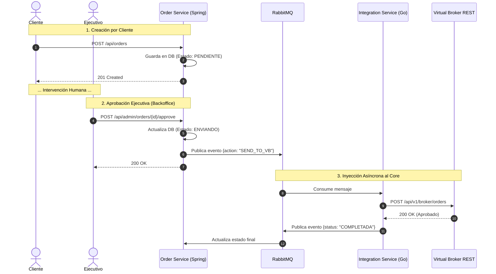
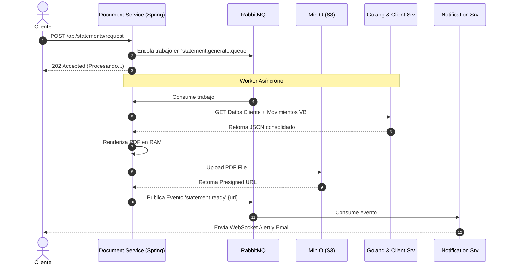

# 🏛️ Documento de Arquitectura de Software (SAD) - UbiBroker

**Proyecto:** UbiBroker
**Fecha:** 27 de Mayo de 2026
**Versión:** 1.0.0

---

## 1. Resumen Ejecutivo
UbiBroker es una plataforma web transaccional diseñada para interactuar con el core de una casa de bolsa (Virtual Broker). La plataforma permite a clientes registrados consultar posiciones consolidadas, detalles de productos, calendarios de vencimientos y crear órdenes/reinversiones. Además, incluye un panel de Backoffice para que ejecutivos aprueben operaciones mediante un flujo "Maker-Checker". 

La arquitectura está basada en microservicios contenerizados (Docker), garantizando alta disponibilidad, separación de responsabilidades y tiempos de respuesta en milisegundos mediante el uso de cachés (Redis) y procesamiento asíncrono (RabbitMQ).

---

## 2. Stack Tecnológico
* **Backend Transaccional:** Spring Boot (Java)
* **Backend de Alto Rendimiento:** Golang
* **Bases de Datos Relacionales:** PostgreSQL (Patrón Database-per-Service)
* **Caché en Memoria:** Redis
* **Mensajería Asíncrona:** RabbitMQ
* **Almacenamiento de Archivos:** MinIO / Amazon S3
* **Observabilidad:** Stack PLG (Promtail, Loki, Tempo, Grafana) + OpenTelemetry

---

## 3. Catálogo de Microservicios

| Microservicio | Tecnología | Base de Datos | Responsabilidad Principal |
| :--- | :--- | :--- | :--- |
| **API Gateway** | Spring Cloud / Nginx | N/A | Único punto de entrada. Enrutamiento y validación inicial de JWT. |
| **Auth Service** | Spring Boot | PostgreSQL | Gestión de identidades, login, recuperación de contraseñas, JWT y OTP. |
| **Client Service** | Spring Boot | PostgreSQL | Mantiene el perfil local del usuario y valida RIF contra Virtual Broker. |
| **Integration Service** | Golang | Redis | Capa anticorrupción (BFF). Lectura masiva ultrarrápida del core de VB. |
| **Order Service** | Spring Boot | PostgreSQL | Motor transaccional. Gestiona el ciclo de vida de órdenes y aprobaciones. |
| **Document Service** | Spring Boot | MinIO (S3) | Worker asíncrono para generación y almacenamiento de PDFs (Estados de cuenta). |
| **Notification Service**| Spring Boot | PostgreSQL | Centro omnicanal. Envía WebSockets, Emails y guarda buzón de alertas. |

---

## 4. Diagrama de Arquitectura Global

## 5. Casos de Uso y Flujos de Datos (Sequence Diagrams)
Caso de Uso 1: Aprobación de Órdenes (Maker-Checker)
Descripción: Un cliente crea una orden, la cual queda en pausa hasta que un ejecutivo la aprueba en el Backoffice.

Caso de Uso 2: Generación de Estados de Cuenta en PDF
Descripción: El sistema genera PDFs de forma asíncrona para no bloquear los hilos principales del servidor.

---
## 6. Diccionario de Endpoints REST (Contratos Base)

6.1. Auth & Security (/api/auth)
POST /login -> Autenticación y generación de JWT.

POST /recover-password -> Dispara flujo de recuperación.

6.2. Client Management (/api/clients)
POST /validate -> Valida RIF/ID contra Virtual Broker.

POST /register -> Crea perfil local.

GET /me -> Consulta de perfil.

PUT /me -> Actualización de datos de contacto.

6.3. Integration / Dashboards (/api/portfolio) - Servidos por Golang/Redis
GET /consolidated -> Posición global (Saldos y Totales).

GET /products -> Detalle de inversiones activas.

GET /calendar?month=X&year=Y -> Eventos de vencimiento formateados.

6.4. Order Management (/api/orders)
POST / -> Crear nueva orden o reinversión (Cliente).

GET / -> Listar histórico (Cliente).

GET /admin?status=PENDIENTE -> Listar pool de órdenes (Ejecutivos).

POST /admin/{id}/approve -> Aprobar transacción (Ejecutivos).

6.5. Documents & Notifications
POST /api/statements/request -> Solicitar estado de cuenta.

GET /api/notifications -> Obtener historial de alertas no leídas.

PATCH /api/notifications/{id}/read -> Marcar alerta como leída.

WS wss://{host}/ws/notifications -> Canal STOMP persistente para alertas en tiempo real.
