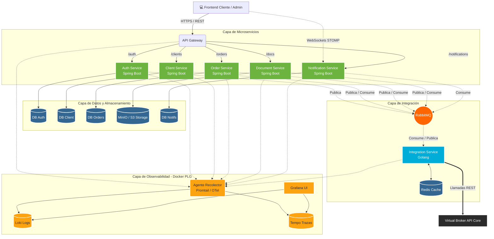

```mermaid
graph TD
    %% Definición de estilos
    classDef spring fill:#6db33f,stroke:#fff,stroke-width:2px,color:#fff;
    classDef go fill:#00add8,stroke:#fff,stroke-width:2px,color:#fff;
    classDef db fill:#336791,stroke:#fff,stroke-width:2px,color:#fff;
    classDef broker fill:#ff6600,stroke:#fff,stroke-width:2px,color:#fff;
    classDef obs fill:#fca311,stroke:#fff,stroke-width:2px,color:#2b2b2b;
    classDef core fill:#2b2b2b,stroke:#fff,stroke-width:2px,color:#fff;

    %% Actores y Entrada
    Client[💻 Frontend Cliente / Admin]
    
    %% Conexiones Frontend
    Client -->|HTTPS / REST| Gateway(API Gateway)
    Client -.->|WebSockets STOMP| Notif[Notification Service <br/> Spring Boot]

    %% Microservicios UbiBroker
    subgraph Capa de Microservicios
        Gateway -->|/auth| Auth[Auth Service <br/> Spring Boot]
        Gateway -->|/clients| ClientSrv[Client Service <br/> Spring Boot]
        Gateway -->|/orders| Order[Order Service <br/> Spring Boot]
        Gateway -->|/docs| Doc[Document Service <br/> Spring Boot]
        Gateway -->|/notifications| Notif
    end

    %% Bases de Datos y Almacenamiento
    subgraph Capa de Datos y Almacenamiento
        Auth --> AuthDB[(DB Auth)]
        ClientSrv --> ClientDB[(DB Client)]
        Order --> OrderDB[(DB Orders)]
        Doc --> S3[(MinIO / S3 Storage)]
        Notif --> NotifDB[(DB Notifs)]
    end

    %% Mensajería
    Auth -.->|Publica| MQ((RabbitMQ))
    ClientSrv -.->|Publica / Consume| MQ
    Order -.->|Publica / Consume| MQ
    Doc -.->|Publica / Consume| MQ
    Notif -.->|Consume| MQ

    %% Integración Core
    subgraph Capa de Integración
        MQ -.->|Consume / Publica| GoSrv[Integration Service <br/> Golang]
        GoSrv <--> Redis[(Redis Cache)]
    end

    %% Sistema Externo
    GoSrv ===>|Llamadas REST| VB[Virtual Broker API Core]

    %% Capa de Observabilidad
    subgraph Capa de Observabilidad - Docker PLG
        Promtail(Agente Recolector <br/> Promtail / OTel)
        Loki[(Loki Logs)]
        Tempo[(Tempo Trazas)]
        Grafana[Grafana UI]

        %% Flujo de Telemetría
        Gateway -.-> Promtail
        Auth -.-> Promtail
        ClientSrv -.-> Promtail
        Order -.-> Promtail
        Doc -.-> Promtail
        Notif -.-> Promtail
        GoSrv -.-> Promtail

        Promtail --> Loki
        Promtail --> Tempo
        Grafana --> Loki
        Grafana --> Tempo
    end

    %% Aplicación de Clases
    class Auth,ClientSrv,Order,Doc,Notif spring;
    class GoSrv go;
    class AuthDB,ClientDB,OrderDB,NotifDB,S3,Redis db;
    class MQ broker;
    class Promtail,Loki,Tempo,Grafana obs;
    class VB core;
```
